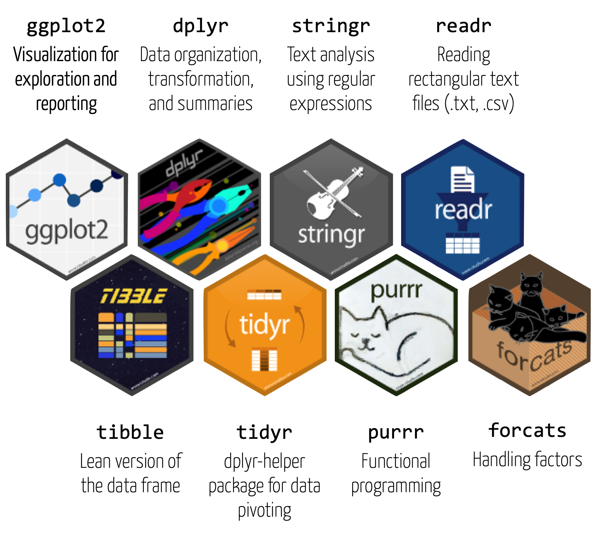
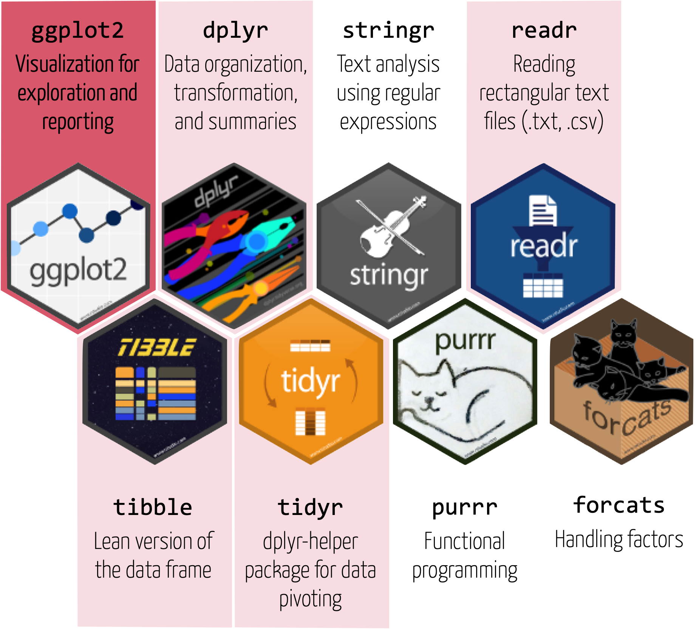
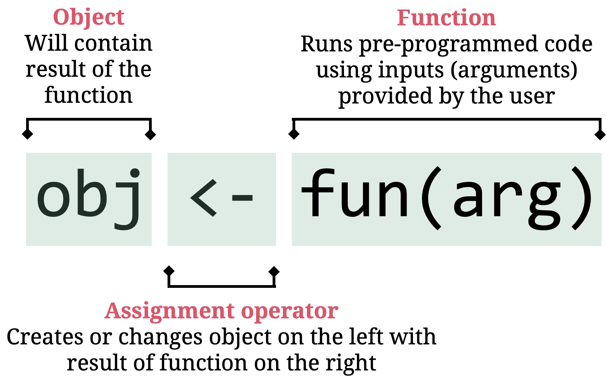
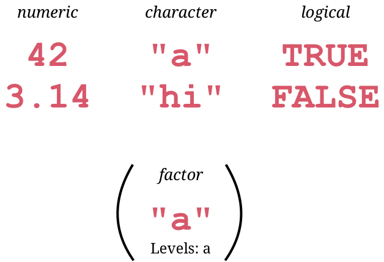
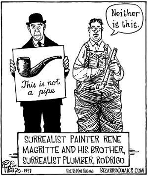

---
```{r, eval = TRUE, echo = FALSE, warning=F,message=F}
# Code to knit slides
baselers <- readr::read_csv("data/baselers.csv")
```

```{r setup, include=FALSE}
options(htmltools.dir.version = FALSE)
# see: https://github.com/yihui/xaringan
# install.packages("xaringan")
# see: 
# https://github.com/yihui/xaringan/wiki
# https://github.com/gnab/remark/wiki/Markdown
options(width=110)
options(digits = 4) 
knitr::opts_chunk$set(comment = NA)

require(tidyverse)
source('../_config.R')
```


# R is a programming language

From [Wikipedia](https://en.wikipedia.org/wiki/Statistical_model) (emphasis added):

> A programming language is a **formal language** that specifies a set of instructions that can be used to produce various kinds of output. Programming languages generally consist of **instructions for a computer**. Programming languages can be used to create programs that **implement specific algorithms**.

.pull-left4[
### Algorithm
1. Load data
2. Extract variables
3. Run analysis
4. Print result
]

.pull-right6[
### Implementation in R
```{r,echo=F}
link = 'https://raw.githubusercontent.com/therbootcamp/therbootcamp.github.io/master/_sessions/_data/my_data.txt'
```

```{r, results='hide'}
data <- read.table("data/my_data.txt")
variables <- data[,c('group','variable')]
analysis <- lm(variable ~ group, data = variables)
summary(analysis)
```
]

---

# Why R?

.pull-left3[
R steadily **grows in popularity**. 

Today, R is one of the **most popular languages for data science** and overall. 

In terms of the number of data science jobs, **R beats SAS and Matlab**, and is on par with Python.

In many sciences it becomes the de factor **lingua franca** for statistics.

<p style="font-size:10px;float:bottom">
  Image source: http://r4stats.com/blog/
<p>


]

.pull-right6[
<p align="center">
  
</p>
]

---

.pull-left3[

# Tidyverse

<ul>
  <li class="m1"><span>The tidyverse is...</span></li><br>
  <ul class="level">
    <li><span>A collection of user-friendly <high>packages</high> for analyzing <high>tidy data</high></span></li><br>
    <li><span>An <high>ecosystem</high> for analytics and data science with common design principles</span></li><br>
    <li><span>A <high>dialect</high> of the R language</span></li>
  </ul>
</ul>

]

.pull-right65[
<br><br>
<p align="center">

</p>
]


---


.pull-left3[

# Tidyverse

<ul>
  <li class="m1"><span>The tidyverse is...</span></li><br>
  <ul class="level">
    <li><span>A collection of user-friendly <high>packages</high> for analyzing <high>tidy data</high></span></li><br>
    <li><span>An <high>ecosystem</high> for analytics and data science with common design principles</span></li><br>
    <li><span>A <high>dialect</high> of the R language</span></li>
  </ul>
</ul>

]

.pull-right65[
<br><br>
<p align="center">

</p>
]

---

# RStudio

.pull-left3[

<ul>
  <li class="m1"><span>RStudio is...</span></li><br>
  <ul class="level">
    <li><span>A high-productivity <high>data science IDE.</high></span></li><br>
    <li><span>The <high>company</high> behind the tidyverse.</span></li><br>
    <li><span>Designed for R tidyverse with <high>good integration</high> for Python, Markdown, or C++.</span></li><br>
  </ul>
</ul>

]

.pull-right6[
<p align="center">

</p>
]


---

<div class="center_text">
  <span>
  Intro 2 Base R
  </span>
</div> 


---

.pull-left4[

# Part 1: Assignments


<ul>
  <li class="m1"><span><high>Assignments</high><br></span></li>
  <ul class="level">
    <li><span>Object <mono><-</mono> function</span></li>
    <li><span><mono><-</mono> creates objects</span></li>
    <li><span><mono><-</mono> changes objects</span></li>
  </ul>
  </span><br>
  <li class="m2g"><span>Functions</span></li>
  <li class="m3g"><span>Pipes</span></li>
</ul>

]

.pull-right5[
<br><br>
<p align = "center">
<br>
<font style="font-size:10px">from <a href="https://xkcd.com//">xkcd.com</a></font>
</p>

]

---

# Object <mono><-</mono> function

.pull-left5[

<ul>
  <li class="m1"><span>Assignments<br></span></li>
  <ul class="level">
    <li><span><high>Object <mono><-</mono> function</high></span></li>
    <li><span><mono><-</mono> creates objects</span></li>
    <li><span><mono><-</mono> changes objects</span></li>
  </ul>
  </span><br>
  <li class="m2g"><span>Functions</span></li>
  <li class="m3g"><span>Pipes</span></li>
</ul>

]

.pull-right5[

<p align="center">
  
</p>


]

---

# <mono><-</mono> creates objects

.pull-left5[

<ul>
  <li class="m1"><span>Assignments<br></span></li>
  <ul class="level">
    <li><span>Object <mono><-</mono> function</span></li>
    <li><span><high><mono><-</mono> creates objects</high></span></li>
    <li><span><mono><-</mono> changes objects</span></li>
  </ul>
  </span><br>
  <li class="m2g"><span>Functions</span></li>
  <li class="m3g"><span>Pipes</span></li>
</ul>

]

.pull-right5[
```{r}
# an object named one_two_three
one_two_three <- c(1, 2, 3)

# print the object
print(one_two_three)

# print the object
one_two_three

```

]

---

# <mono><-</mono> creates objects

.pull-left5[

<ul>
  <li class="m1"><span>Assignments<br></span></li>
  <ul class="level">
    <li><span>Object <mono><-</mono> function</span></li>
    <li><span><high><mono><-</mono> creates objects</high></span></li>
    <li><span><mono><-</mono> changes objects</span></li>
  </ul>
  </span><br>
  <li class="m2g"><span>Functions</span></li>
  <li class="m3g"><span>Pipes</span></li>
</ul>

]

.pull-right5[
```{r}
# an object named one_two_three
one_two_three <- c(1, 2, 3)

# calculate the mean
mean(one_two_three)
```

]

---

# <mono><-</mono> creates objects

.pull-left5[

<ul>
  <li class="m1"><span>Assignments<br></span></li>
  <ul class="level">
    <li><span>Object <mono><-</mono> function</span></li>
    <li><span><high><mono><-</mono> creates objects</high></span></li>
    <li><span><mono><-</mono> changes objects</span></li>
  </ul>
  </span><br>
  <li class="m2g"><span>Functions</span></li>
  <li class="m3g"><span>Pipes</span></li>
</ul>

]

.pull-right5[
```{r}
# an object named one_two_three
one_two_three <- c(1, 2, 3)

# calculate the mean
result <- mean(one_two_three)

# print result
result
```

]

---

# <mono><-</mono> creates objects

.pull-left5[

<ul>
  <li class="m1"><span>Assignments<br></span></li>
  <ul class="level">
    <li><span>Object <mono><-</mono> function</span></li>
    <li><span><high><mono><-</mono> creates objects</high></span></li>
    <li><span><mono><-</mono> changes objects</span></li>
  </ul>
  </span><br>
  <li class="m2g"><span>Functions</span></li>
  <li class="m3g"><span>Pipes</span></li>
</ul>

]

.pull-right5[
```{r}
# an object named one_two_three
one_two_three <- c(1, 2, 3)

# calculate the mean
result <- mean(one_two_three)

# use result
result * 10
```

]


---

# <mono><-</mono> changes objects

.pull-left5[

<ul>
  <li class="m1"><span>Assignments<br></span></li>
  <ul class="level">
    <li><span>Object <mono><-</mono> function</span></li>
    <li><span><mono><-</mono> creates objects</span></li>
    <li><span><high><mono><-</mono> changes objects</high></span></li>
  </ul>
  </span><br>
  <li class="m2g"><span>Functions</span></li>
  <li class="m3g"><span>Pipes</span></li>
</ul>

]

.pull-right5[
```{r}
# an object named one_two_three
one_two_three <- c(1, 2, 3)

# print the object
one_two_three

# use the object
one_two_three + 100

# print the object
one_two_three

```

]


---

# <mono><-</mono> changes objects

.pull-left5[

<ul>
  <li class="m1"><span>Assignments<br></span></li>
  <ul class="level">
    <li><span>Object <mono><-</mono> function</span></li>
    <li><span><mono><-</mono> creates objects</span></li>
    <li><span><high><mono><-</mono> changes objects</high></span></li>
  </ul>
  </span><br>
  <li class="m2g"><span>Functions</span></li>
  <li class="m3g"><span>Pipes</span></li>
</ul>

]

.pull-right5[
```{r}
# an object named one_two_three
one_two_three <- c(1, 2, 3)

# print the object
one_two_three

# use the object
one_two_three <- one_two_three + 100

# print the object
one_two_three

```

]


---

# Part 2: Functions

.pull-left4[

<ul>
  <li class="m1g"><span>Assignments<br></span></li>
  <li class="m2"><span><high>Functions</high></span></li>
  <ul class="level">
    <li><span>Everything happens using functions</span></li>
    <li><span>Functions have (default) arguments</span></li>
    <li><span>The class of functions matters</span></li>
    <li><span>Functions "live" in packages</span></li>
    <li><span>Receive help using <mono>?</span></li>
  </ul><br>
  <li class="m3g"><span>Pipes<br></span></li>
</ul>

]

.pull-right5[
<p align = "center">
<br>
<font style="font-size:10px">from <a href="https://xkcd.com//">xkcd.com</a></font>
</p>

]

---

# Functions 

.pull-left4[

<ul>
  <li class="m1g"><span>Assignments<br></span></li>
  <li class="m2"><span><high>Functions</high></span></li>
  <ul class="level">
    <li><span>Everything happens using functions</span></li>
    <li><span>Functions have (default) arguments</span></li>
    <li><span>The class of functions matters</span></li>
    <li><span>Functions "live" in packages</span></li>
    <li><span>Receive help using <mono>?</span></li>
  </ul><br>
  <li class="m3g"><span>Pipes<br></span></li>
</ul>
]

.pull-right5[
<p align="center"></p>
]

---

# Functions 

.pull-left4[
<ul>
  <li class="m1g"><span>Assignments<br></span></li>
  <li class="m2"><span>Functions</span></li>
  <ul class="level">
    <li><span><high>Everything happens using functions</high></span></li>
    <li><span>Functions have (default) arguments</span></li>
    <li><span>The class of functions matters</span></li>
    <li><span>Functions "live" in packages</span></li>
    <li><span>Receive help using <mono>?</span></li>
  </ul><br>
  <li class="m3g"><span>Pipes<br></span></li>
</ul>
]

.pull-right5[
```{r}
# function c()
one_two_three <- c(1, 2, 3)

# function `+`()
one_two_three + 100

# function print()
one_two_three

# function mean()
mean(one_two_three)

```
]


---

# Arguments 

.pull-left4[
<ul>
  <li class="m1g"><span>Assignments<br></span></li>
  <li class="m2"><span>Functions</span></li>
  <ul class="level">
    <li><span>Everything happens using functions</span></li>
    <li><span><high>Functions have (default) arguments</high></span></li>
    <li><span>The class of functions matters</span></li>
    <li><span>Functions "live" in packages</span></li>
    <li><span>Receive help using <mono>?</span></li>
  </ul><br>
  <li class="m3g"><span>Pipes<br></span></li>
</ul>
]

.pull-right5[
```{r, error=TRUE,tidy=T}
# no argument
mean()

# one (necessary) argument
mean(c(1, 2, 3))

# add missing value (NA)
mean(c(1, 2, 3, NA))
```
]


---

# Arguments

.pull-left4[
<ul>
  <li class="m1g"><span>Assignments<br></span></li>
  <li class="m2"><span>Functions</span></li>
  <ul class="level">
    <li><span>Everything happens using functions</span></li>
    <li><span><high>Functions have (default) arguments</high></span></li>
    <li><span>The class of functions matters</span></li>
    <li><span>Functions "live" in packages</span></li>
    <li><span>Receive help using <mono>?</span></li>
  </ul><br>
  <li class="m3g"><span>Pipes<br></span></li>
</ul>
]

.pull-right5[
```{r, error=TRUE,tidy=T}
# no argument
mean()

# one (necessary) argument
mean(c(1, 2, 3))

# change default to remove NAs
mean(c(1, 2, 3, NA), na.rm = TRUE)

```
]

---

# Arguments

.pull-left4[
<ul>
  <li class="m1g"><span>Assignments<br></span></li>
  <li class="m2"><span>Functions</span></li>
  <ul class="level">
    <li><span>Everything happens using functions</span></li>
    <li><span><high>Functions have (default) arguments</high></span></li>
    <li><span>The class of functions matters</span></li>
    <li><span>Functions "live" in packages</span></li>
    <li><span>Receive help using <mono>?</span></li>
  </ul><br>
  <li class="m3g"><span>Pipes<br></span></li>
</ul>
]

.pull-right5[
```{r, error=TRUE,tidy=T}
# explicit argument names
mean(x = c(1, 2, 3, NA), na.rm = TRUE)

# with names order does not matter
mean(na.rm = TRUE, x = c(1, 2, 3, NA))

# without names order matters
mean(TRUE, c(1, 2, 3, NA))

```
]


---

# Classes 

.pull-left4[
<ul>
  <li class="m1g"><span>Assignments<br></span></li>
  <li class="m2"><span>Functions</span></li>
  <ul class="level">
    <li><span>Everything happens using functions</span></li>
    <li><span>Functions have (default) arguments</span></li>
    <li><span><high>The class of functions matters</high></span></li>
    <li><span>Functions "live" in packages</span></li>
    <li><span>Receive help using <mono>?</span></li>
  </ul><br>
  <li class="m3g"><span>Pipes<br></span></li>
</ul>
]

.pull-right5[

<p align = "center">
<br>
</p>

]


---

# Classes 

.pull-left4[
<ul>
  <li class="m1g"><span>Assignments<br></span></li>
  <li class="m2"><span>Functions</span></li>
  <ul class="level">
    <li><span>Everything happens using functions</span></li>
    <li><span>Functions have (default) arguments</span></li>
    <li><span><high>The class of functions matters</high></span></li>
    <li><span>Functions "live" in packages</span></li>
    <li><span>Receive help using <mono>?</span></li>
  </ul><br>
  <li class="m3g"><span>Pipes<br></span></li>
</ul>
]

.pull-right5[
```{r, error=TRUE,tidy=T}

# calculate mean of c(1, 2, 3)
mean(c(1, 2, 3))

# calculate mean of c("1", "2", "3")
mean(c("1", "2", "3"))
```
]

---

# Classes 

.pull-left4[
<ul>
  <li class="m1g"><span>Assignments<br></span></li>
  <li class="m2"><span>Functions</span></li>
  <ul class="level">
    <li><span>Everything happens using functions</span></li>
    <li><span>Functions have (default) arguments</span></li>
    <li><span><high>The class of functions matters</high></span></li>
    <li><span>Functions "live" in packages</span></li>
    <li><span>Receive help using <mono>?</span></li>
  </ul><br>
  <li class="m3g"><span>Pipes<br></span></li>
</ul>
]

.pull-right5[
```{r, error=TRUE,tidy=T}

# calculate sum of c(1, 2, 3)
sum(c(1, 2, 3))

# calculate sum of c("1", "2", "3")
sum(c("1", "2", "3"))
```
]


---

# Packages 

.pull-left4[
<ul>
  <li class="m1g"><span>Assignments<br></span></li>
  <li class="m2"><span>Functions</span></li>
  <ul class="level">
    <li><span>Everything happens using functions</span></li>
    <li><span>Functions have (default) arguments</span></li>
    <li><span>The class of functions matters</span></li>
    <li><span><high>Functions "live" in packages</high></span></li>
    <li><span>Receive help using <mono>?</span></li>
  </ul><br>
  <li class="m3g"><span>Pipes<br></span></li>
</ul>
]

.pull-right5[
<p align="center"></p>
]

---

# Packages 

.pull-left4[
<ul>
  <li class="m1g"><span>Assignments<br></span></li>
  <li class="m2"><span>Functions</span></li>
  <ul class="level">
    <li><span>Everything happens using functions</span></li>
    <li><span>Functions have (default) arguments</span></li>
    <li><span>The class of functions matters</span></li>
    <li><span><high>Functions "live" in packages</high></span></li>
    <li><span>Receive help using <mono>?</span></li>
  </ul><br>
  <li class="m3g"><span>Pipes<br></span></li>
</ul>
]

.pull-right5[

<high>Install</high> Packages <high>once</high> with `install.packages()`

```{r, eval = FALSE}
install.packages("tidyverse")
```
<br2>
<high>Load</high> installed Pakete <high>every time</high> with `library()`

```{r, eval = FALSE}
library(tidyverse)
```

<p align="left"></p>
]
---

# Help 

.pull-left4[
<ul>
  <li class="m1g"><span>Assignments<br></span></li>
  <li class="m2"><span>Functions</span></li>
  <ul class="level">
    <li><span>Everything happens using functions</span></li>
    <li><span>Functions have (default) arguments</span></li>
    <li><span>The class of functions matters</span></li>
    <li><span>Functions "live" in packages</span></li>
    <li><span><high>Receive help using <mono>?</high></span></li>
  </ul><br>
  <li class="m3g"><span>Pipes<br></span></li>
</ul>
]

.pull-right5[
```{r}
?cor
```
<p align="center"></p>
]

---

# Part 3: Pipes 

.pull-left4[
<ul>
  <li class="m1g"><span>Assignments<br></span></li>
  <li class="m2g"><span>Functions<br></span></li>
  <li class="m3"><span><high>Pipes</high><br></span></li>
  <ul class="level">
    <li><span>Swap object and function</span></li>
    <li><span>Make chaining easy</span></li>
  </ul>
</ul>
]

.pull-right5[

<p align = "center">
<br>
<font style="font-size:10px">from <a href="https://knowyourmeme.com/photos/1217327-this-is-not-a-pipe-parodies">knowyourmeme.com</a></font>
</p>


]

---

# Pipes 

.pull-left4[
<ul>
  <li class="m1g"><span>Assignments<br></span></li>
  <li class="m2g"><span>Functions<br></span></li>
  <li class="m3"><span>Pipes<br></span></li>
  <ul class="level">
    <li><span><high>Swap object and function</high></span></li>
    <li><span>Make chaining easy</span></li>
  </ul>
</ul>
]

.pull-right5[
```{r}
# Numeric vector
score <- c(8, 4, 6, 3, 7, 3)
score

# Mean: Base-R-style
mean(score)

# Mean: dplyr-style
score %>%  
  mean()  
```
]

---

# Pipes 

.pull-left4[
<ul>
  <li class="m1g"><span>Assignments<br></span></li>
  <li class="m2g"><span>Functions<br></span></li>
  <li class="m3"><span>Pipes<br></span></li>
  <ul class="level">
    <li><span><high>Swap object and function</high></span></li>
    <li><span>Make chaining easy</span></li>
  </ul>
</ul>
]

.pull-right5[

<p align="center">
  
</p>

]

---

# Pipes 

.pull-left4[
<ul>
  <li class="m1g"><span>Assignments<br></span></li>
  <li class="m2g"><span>Functions<br></span></li>
  <li class="m3"><span>Pipes<br></span></li>
  <ul class="level">
    <li><span>Swap object and function</span></li>
    <li><span><high>Make chaining easy</high></span></li>
  </ul>
</ul>
]

.pull-right5[
```{r}
# Numeric vector
score <- c(8, 4, 6, 3, 7, 3)
score

# Chainig
score %>%  
  mean() %>% 
  round(digits = 2)
```
]

---

# Pipes 

.pull-left4[
<ul>
  <li class="m1g"><span>Assignments<br></span></li>
  <li class="m2g"><span>Functions<br></span></li>
  <li class="m3"><span>Pipes<br></span></li>
  <ul class="level">
    <li><span>Swap object and function</span></li>
    <li><span><high>Make chaining easy</high></span></li>
  </ul>
</ul>
]

.pull-right5[
```{r}
# Numeric vector
score <- c(8, 4, 6, 3, 7, 3)
score

# Chainig
score %>%  
  mean() %>% 
  round(digits = 2) %>% 
  as.character()
```
]


---

class: middle, center

<h1><a>Interactive</a></h1>
<h2>Open the TheRBootcamp project file</h2>


