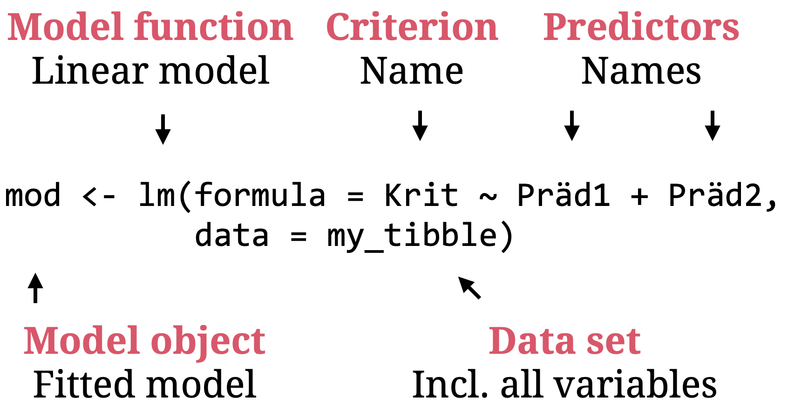

---

```{r, eval = TRUE, echo = FALSE, warning=F,message=F}
# Code to knit slides

```

```{r setup, include=FALSE}
options(htmltools.dir.version = FALSE)
options(width = 110)
options(digits = 4)

# Load packages
require(tidyverse)
source('../config.R')
print2 <- function(x, nlines=10,...) {
   cat(head(capture.output(print(x,...)), nlines), sep="\n")}

# Load data
baselers <- readr::read_csv("1_Data/baselers.csv")

# get color palette functions
source("../../_materials/palette/therbootcamp_palettes.R")
colors = baselrbootcamp_colors

knitr::opts_chunk$set(dpi = 300, echo = FALSE, warning = FALSE, fig.align = 'center', message= FALSE)

```


# General Linear Models

.pull-left4[

<ul>
  <li class="m1"><span>The general linear model is the swiss army knife of statistics.</span></li>
  <li class="m2"><span>This includes:</span></li>
  <ul class="level">
    <li><span><high>Regression</high></li></span>
    <li><span><high>t-Test<high></li></span>
    <li><span><high>Analysis of variance (ANOVA)</high></li></span>
    <li><span>Mediationanalysis</li></span>
    <li><span>Factoranalysis</li></span>
    <li><span>Structural Equation Modeling</li></span>
  </ul>
</ul>

]

.pull-right5[

<p align="center">


</p>
]


---

# Simple linear regression

.pull-left4[


<ul>
  <li class="m1"><span>How well does a <high>linear function using one predictor (x)</high> account for the criterion (y)?</span></li>
  <li class="m2"><span>Parameters:</span></li>
  <ul class="level">
    <li><span>&beta;<sub>0</sub>: <high>Intercept</high> of y-axis</span></li>
    <li><span>&beta;<sub>1</sub>: <high>Slope</high></span></li>
  </ul>
</ul>

<br>

$$\Large \hat{y} = b_0 + b_1  * x$$

]

.pull-right5[

```{r, echo = FALSE, fig.width = 3.5, fig.height = 3}

library(tidyverse) ; library(ggrepel)

# Lade Tourismus Daten
tour <- read_csv('1_Data/Tourismus.csv') 
europa <- read_csv('1_Data/Europa.csv') 

# Berechne Nächte per Region
d = tour %>%
  mutate(Nächte = Besucher * Dauer) %>%
  left_join(europa) %>% 
  rename(Nights = Nächte,
         `Equivalent income` = Äquivalenzeinkommen)

m = coef(lm(log2(Nights) ~ `Equivalent income`, data = d))

ggplot(d, 
       aes(x = `Equivalent income`, 
           y = Nights,
           label = Land)) +
  scale_y_continuous(trans = 'log2') + 
  geom_point() +
  geom_abline(intercept = m[1], slope = m[2], col = '#EA4B68', size = 1.5) + 
  theme_bw()

```

]


---

# Simple linear regression

.pull-left4[


<ul>
  <li class="m1"><span>How well does a <high>linear function using one predictor (x)</high> account for the criterion (y)?</span></li>
  <li class="m2"><span>Parameters:</span></li>
  <ul class="level">
    <li><span>&beta;<sub>0</sub>: <high>Intercept</high> of y-axis</span></li>
    <li><span>&beta;<sub>1</sub>: <high>Slope</high></span></li>
  </ul>
</ul>

<br>

$$\Large \hat{Nächte} = b_0 + b_1  * Äquiv.eink.$$

]

.pull-right5[

```{r, echo = FALSE, fig.width = 3.5, fig.height = 3}

library(tidyverse) ; library(ggrepel)

# Lade Tourismus Daten
tour <- read_csv('1_Data/Tourismus.csv') 
europa <- read_csv('1_Data/Europa.csv') 

# Berechne Nächte per Region
d = tour %>%
  mutate(Nächte = Besucher * Dauer) %>%
  left_join(europa) %>% 
  rename(Nights = Nächte,
         `Equivalent income` = Äquivalenzeinkommen)

m = coef(lm(log2(Nights) ~ `Equivalent income`, data = d))

ggplot(d, 
       aes(x = `Equivalent income`, 
           y = Nights,
           label = Land)) +
  scale_y_continuous(trans = 'log2') + 
  geom_point() +
  geom_abline(intercept = m[1], slope = m[2], col = '#EA4B68', size = 1.5) + 
  theme_bw()

```

]

---

# Multiple lineare regression

.pull-left4[

<ul>
  <li class="m1"><span>How well does a <high>linear function using multiple predictors (x)</high> account for the criterion (y)?</span></li>
  <li class="m2"><span>Parameter:</span></li>
  <ul class="level">
    <li><span>&beta;<sub>0</sub>: <high>Intercept</high> of y-axis</span></li>
    <li><span>&beta;<sub>1</sub>: <high>Slope</high> for x<sub>1</sub></span></li>
    <li><span>&beta;<sub>2</sub>: <high>Slope</high> for x<sub>2</sub></span></li>
    <li><span>&beta;<sub>3</sub>: <high>Slope</high> for x<sub>k</sub></span></li>
  </ul>
</ul>

<br>

$$\Large \hat{y} = b_0 + b_1  \cdot x_1 + ... b_k \cdot x_k$$

]

.pull-right5[

```{r, echo = FALSE, fig.width = 3.5, fig.height = 3}

library(tidyverse) ; library(ggrepel)

# Lade Tourismus Daten
tour <- read_csv('1_Data/Tourismus.csv') 
europa <- read_csv('1_Data/Europa.csv') 

# Berechne Nächte per Region
d = tour %>%
  mutate(Nächte = Besucher * Dauer) %>%
  left_join(europa) %>% 
  filter(!is.na(Äquivalenzeinkommen)) %>% 
  rename(Nights = Nächte,
         `Equivalent income` = Äquivalenzeinkommen,
         Population = Bevölkerung)


m = lm(Nights_log2 ~ `Equivalent income` + Population, data = d %>% mutate(Nights_log2 = log2(Nights)))

res <- 1000

#Setup Axis
x <- seq(min(d$`Equivalent income`), max(d$`Equivalent income`), by = res)
y <- seq(min(d$Population), max(d$Population), by = res)

#Sample points
surface <- expand.grid(`Equivalent income` = x,
                       Population = y, 
                       KEEP.OUT.ATTRS = F)
surface$Nights_log2 <- predict.lm(m, newdata = surface)
surface <- reshape2::acast(surface, Population ~ `Equivalent income`, value.var = "Nights_log2")

require(plotly)
plt = plot_ly(d %>% mutate(Nights_log2 = log2(Nights)), 
        x = ~`Equivalent income`, 
        y = ~Population, 
        z = ~Nights_log2,
        type = "scatter3d",
        width = 500, height = 420)

plt = add_trace(p = plt,
          z = surface,
          x = x,
          y = y,
          type = "surface",
        showscale=FALSE) 
plt %>%  layout(showlegend = FALSE)
   

```

]

---

# Formulas

.pull-left4[

<ul>
  <li class="m1"><span>Models in R are defined using <highm>formula</highm> expressions.</span></li>
</ul>

<font style="font-size:20px"><u>Syntax</u></p>

<table style="cellspacing:0; cellpadding:0; border:none; padding-top:10px" width=100%>
  <col width="40%">
  <col width="60%">
<tr>
  <td bgcolor="white">
    <b>Function</b>
  </td>
  <td bgcolor="white">
    <b>Description</b>
  </td> 
</tr>
<tr>
  <td bgcolor="white">
  <mono>+</mono> / <mono>-</mono>
  </td>
  <td bgcolor="white">
  Add / remove predictor.
  </td> 
</tr>
<tr>
  <td bgcolor="white">
  <mono>*</mono> / <mono>:</mono> 
  </td>
  <td bgcolor="white">
   Add interactions with or w/o main effects.    
  </td> 
</tr>
<tr>
  <td bgcolor="white">
  <mono>1</mono> / <mono>0</mono> 
  </td>
  <td bgcolor="white">
  Add / remove intercept
  </td> 
</tr>
<tr>
  <td bgcolor="white">
  <mono>.</mono> 
  </td>
  <td bgcolor="white">
  Add all predictors.
  </td> 
</tr>
</table>

]

<br>

.pull-right5[

<p align="center">

</p>
]


---

# <mono>lm()</mono>

.pull-left35[

<font style="font-size:20px"><u>Fitting</u></p>

<table style="cellspacing:0; cellpadding:0; border:none; padding-top:10px" width=100%>
  <col width="40%">
  <col width="60%">
<tr>
  <td bgcolor="white">
    <b>Function</b>
  </td>
  <td bgcolor="white">
    <b>Description</b>
  </td> 
</tr>
<tr>
  <td bgcolor="white">
    <mono>lm(formula, data)</mono>
  </td>
  <td bgcolor="white">
    Fit a <high>linear model</high>.
  </td> 
</tr>
</table>

<font style="font-size:20px"><u>Evaluation</u></p>

<table style="cellspacing:0; cellpadding:0; border:none; padding-top:10px" width=100%>
  <col width="40%">
  <col width="60%">
<tr>
  <td bgcolor="white">
    <b>Function</b>
  </td>
  <td bgcolor="white">
    <b>Description</b>
  </td> 
</tr>
<tr>
  <td bgcolor="white">
  <mono>summary()</mono>
  </td>
  <td bgcolor="white">
  Show <high>result overview</high>.
  </td> 
</tr>
<tr>
  <td bgcolor="white">
   <mono>coef(mod)</mono>   
  </td>
  <td bgcolor="white">
   Extract <high>coefficients</high>.    
  </td> 
</tr>
<tr>
  <td bgcolor="white">
   <mono>predict(mod)</mono>, <mono>resid(mod)</mono>
  </td>
  <td bgcolor="white">
    Extract <high>fitted values</high> / <high>residuals</high>.
  </td> 
</tr>
</table>

]

.pull-right6[

```{r}
nights = tour %>%
  mutate(Nights = Besucher * Dauer) %>%
  left_join(europa) %>% 
  filter(!is.na(Äquivalenzeinkommen)) %>% 
  mutate(Nights_log2 = log2(Nights)) %>% 
  rename(`Equivalent income` = Äquivalenzeinkommen,
         Population = Bevölkerung)

```


```{r, echo = TRUE}
# Fit model
nights_lm <- lm(
  formula = Nights ~ `Equivalent income` + Population,
  data = nights)
```

]


---

# <mono>lm()</mono>

.pull-left35[

<font style="font-size:20px"><u>Fitting</u></p>

<table style="cellspacing:0; cellpadding:0; border:none; padding-top:10px" width=100%>
  <col width="40%">
  <col width="60%">
<tr>
  <td bgcolor="white">
    <b>Function</b>
  </td>
  <td bgcolor="white">
    <b>Description</b>
  </td> 
</tr>
<tr>
  <td bgcolor="white">
    <mono>lm(formula, data)</mono>
  </td>
  <td bgcolor="white">
    Fit a <high>linear model</high>.
  </td> 
</tr>
</table>

<font style="font-size:20px"><u>Evaluation</u></p>

<table style="cellspacing:0; cellpadding:0; border:none; padding-top:10px" width=100%>
  <col width="40%">
  <col width="60%">
<tr>
  <td bgcolor="white">
    <b>Function</b>
  </td>
  <td bgcolor="white">
    <b>Description</b>
  </td> 
</tr>
<tr>
  <td bgcolor="white">
  <mono>summary()</mono>
  </td>
  <td bgcolor="white">
  Show <high>result overview</high>.
  </td> 
</tr>
<tr>
  <td bgcolor="white">
   <mono>coef(mod)</mono>   
  </td>
  <td bgcolor="white">
   Extract <high>coefficients</high>.    
  </td> 
</tr>
<tr>
  <td bgcolor="white">
   <mono>predict(mod)</mono>, <mono>resid(mod)</mono>
  </td>
  <td bgcolor="white">
    Extract <high>fitted values</high> / <high>residuals</high>.
  </td> 
</tr>
</table>

]

.pull-right6[


```{r, echo = TRUE}
# Printe naechte_lm
nights_lm
```

]


---

# <mono>summary()</mono>

.pull-left35[

<font style="font-size:20px"><u>Fitting</u></p>

<table style="cellspacing:0; cellpadding:0; border:none; padding-top:10px" width=100%>
  <col width="40%">
  <col width="60%">
<tr>
  <td bgcolor="white">
    <b>Function</b>
  </td>
  <td bgcolor="white">
    <b>Description</b>
  </td> 
</tr>
<tr>
  <td bgcolor="white">
    <mono>lm(formula, data)</mono>
  </td>
  <td bgcolor="white">
    Fit a <high>linear model</high>.
  </td> 
</tr>
</table>

<font style="font-size:20px"><u>Evaluation</u></p>

<table style="cellspacing:0; cellpadding:0; border:none; padding-top:10px" width=100%>
  <col width="40%">
  <col width="60%">
<tr>
  <td bgcolor="white">
    <b>Function</b>
  </td>
  <td bgcolor="white">
    <b>Description</b>
  </td> 
</tr>
<tr>
  <td bgcolor="white">
  <mono>summary()</mono>
  </td>
  <td bgcolor="white">
  Show <high>result overview</high>.
  </td> 
</tr>
<tr>
  <td bgcolor="white">
   <mono>coef(mod)</mono>   
  </td>
  <td bgcolor="white">
   Extract <high>coefficients</high>.    
  </td> 
</tr>
<tr>
  <td bgcolor="white">
   <mono>predict(mod)</mono>, <mono>resid(mod)</mono>
  </td>
  <td bgcolor="white">
    Extract <high>fitted values</high> / <high>residuals</high>.
  </td> 
</tr>
</table>

]


.pull-right6[

```{r, echo = TRUE, eval = F}
# Show results
summary(nights_lm)
```

```{r, echo = FALSE}
# Show results
print2(summary(nights_lm),15)
```

]


---

# Categorical Variables

.pull-left4[

<ul>
  <li class="m1"><span>The general linear model can deal with <high>categorical predictors</high>.</span></li>
  <li class="m2"><span>In addition to  <high>dedizierten Tests</high> (e.g., <mono>t.test()</mono>), such predicators can also be added into <mono>lm()</mono>.</span></li>
  <li class="m3"><span>Examples</span></li>
  <ul class="level">
    <li><span><high>Comparison of multiple groups</high></li></span>
    <li><span><high>A/B tests<high></li></span>
  </ul>
</ul>

]

.pull-right5[

```{r, echo = F, fig.width = 3.5, fig.height = 3}

library(tidyverse) ; library(ggrepel)

# Lade Tourismus Daten
tour <- read_csv('1_Data/Tourismus.csv') 
europa <- read_csv('1_Data/Europa.csv') 

# Berechne Nächte per Region
tour = tour %>%
  mutate(Nights = Besucher * Dauer) %>%
  left_join(europa) %>% 
  mutate(Nights_log = log2(Nights),
         Region = stringr::str_trunc(Region, 7, ellipsis = "."))

tour %>%  filter(Region %in% c('Europa','Asien')) %>% 
  ggplot(aes(x = Region, 
             y = Nights)) +
  scale_y_continuous(trans = 'log2') + 
  geom_boxplot() +
  theme_minimal() 

```

]

---

# `t.test()`

.pull-left4[
<ul>
  <li class="m1"><span>The t-test <high>compares two groups</high> in one continous variable.</span></li>
  <li class="m2"><span>The null-hypothesis states that these groups have <high>identical means</high>.</span></li>
  <li class="m3"><span>Examples</span></li>
  <ul class="level">
    <li><span><high>Comparison of multiple groups</high></li></span>
    <li><span><high>A/B tests<high></li></span>
  </ul>
</ul>

]


.pull-right5[

```{r, echo = T, fig.width = 3.5, fig.height = 3}
# t-test
t.test(tour$Nights_log[tour$Region == 'Europa'],
       tour$Nights_log[tour$Region == 'Asien'])
```


]

---

# `lm()`

.pull-left4[
<ul>
  <li class="m1"><span>The t-test <high>compares two groups</high> in one continous variable.</span></li>
  <li class="m2"><span>The null-hypothesis states that these groups have <high>identical means</high>.</span></li>
  <li class="m3"><span>Examples</span></li>
  <ul class="level">
    <li><span><high>Comparison of multiple groups</high></li></span>
    <li><span><high>A/B tests<high></li></span>
  </ul>
</ul>
]


.pull-right5[

```{r, echo = T, fig.width = 3.5, fig.height = 3}
lm(Nights_log ~ Region, 
   tour %>% 
     filter(Region %in% c('Europa', 'Asien')))
```

]


---

# Coding

.pull-left4[

<ul>
  <li class="m1"><span>Categorical variables have to be recoded into <high>k-1 new variables</high>.</span></li>
  <li class="m2"><span>Two ways to code this:</span></li>
  <ul>
    <li><span><high>Dummy coding</high> recodes values of one category into 1, else 0<br>&rarr; <high>intercept = 0-category</high></span></li><br>
    <li><span><high>Effect coding</high> recodes values of one category into 1, else -1<br>&rarr; <high>Intercept  =  &#563;  </high></span></li>
  </ul>
</ul>

]

.pull-right5[

<p align="center">


</p>
]

---

# t-Test - three types

.pull-left4[
<ul>
  <li class="m1"><span>The t-test <high>compares two groups</high> in one continous variable.</span></li>
  <li class="m2"><span>The null-hypothesis states that these groups have <high>identical means</high>.</span></li>
  <li class="m3"><span>Examples</span></li>
  <ul class="level">
    <li><span><high>Comparison of multiple groups</high></li></span>
    <li><span><high>A/B tests<high></li></span>
  </ul>
</ul>
]


.pull-right5[

```{r, echo = T, fig.width = 3.5, fig.height = 3}
# Regular t-test
t_test <- 
t.test(tour$Nights_log[tour$Region == 'Europa'],
       tour$Nights_log[tour$Region == 'Asien'], 
       var.equal = TRUE)

# Regression with dummy
lm_dummy <- lm(
  Nights_log ~ Region, 
  tour %>% 
    filter(Region %in% c('Europa', 'Asien')))

# Regression with effect
lm_effect <- lm(
  Nights_log ~ Region, 
  tour %>% 
    filter(Region %in% c('Europa', 'Asien')),
  contrasts = list(Region = contr.sum))
```

]


---

# t-Test - three types

.pull-left4[
<ul>
  <li class="m1"><span>The t-test <high>compares two groups</high> in one continous variable.</span></li>
  <li class="m2"><span>The null-hypothesis states that these groups have <high>identical means</high>.</span></li>
  <li class="m3"><span>Examples</span></li>
  <ul class="level">
    <li><span><high>Comparison of multiple groups</high></li></span>
    <li><span><high>A/B tests<high></li></span>
  </ul>
</ul>
]


.pull-right5[

```{r, echo = T, fig.width = 3.5, fig.height = 3}
t_test[c('statistic','parameter','p.value')]        %>% unlist

summary(lm_dummy)$coef

summary(lm_effect)$coef
```

]

---

# Multiple Categories

.pull-left4[
<ul>
  <li class="m1"><span>If there are more than two categories <high><mono>k - 1</mono> dummy variables</high> will be constructed.</span></li>
  <li class="m2"><span>Everything else stays the same.</span></li>
</ul>
]

.pull-right5[
```{r, echo = F, fig.width = 3.5, fig.height = 3}

tour %>%
  ggplot(aes(x = Region, 
             y = Nights)) +
  scale_y_continuous(trans = 'log2') + 
  geom_boxplot() +
  theme_minimal() +
  theme(axis.text.x = element_text(angle = 45, hjust = 1))

```
]


---

# Multiple categories

.pull-left4[
<ul>
  <li class="m1"><span>If there are more than two categories <high><mono>k - 1</mono> dummyvariables</high> will be constructed.</span></li>
  <li class="m2"><span>Everything else stays the same.</span></li>
</ul>
]

.pull-right5[

<p align="center">


</p>
]


---

# `lm()`

.pull-left35[
<ul>
  <li class="m1"><span>If there are more than two categories <high><mono>k - 1</mono> dummyvariables</high> will be constructed.</span></li>
  <li class="m2"><span>Everything else stays the same.</span></li>
</ul>
]


.pull-right55[

```{r}
options(width=55)
```

```{r, echo = T, fig.width = 3.5, fig.height = 3}
# Regression with all regions
lm(Nights_log ~ Region, 
   tour)
```

]


---

# `lm()`

.pull-left35[
<ul>
  <li class="m1"><span>If there are more than two categories <high><mono>k - 1</mono> dummyvariables</high> will be constructed.</span></li>
  <li class="m2"><span>Everything else stays the same.</span></li>
</ul>
]


.pull-right55[

```{r, echo = T, fig.width = 3.5, fig.height = 3}
# Regression with all regions
mod <- lm(Nights_log ~ Region, 
          tour)

# Show results
summary(mod)$coef
```

]

---

# `anova()`

.pull-left35[
<ul>
  <li class="m1"><span>Analysis of variance (ANOVA) is a generalization of the t-test and can be understood as a <high>special case of regression</high>.</span></li>
  <li class="m2"><span>The null hypothesis states that all groups have <high>identical means</high>.</span></li>
</ul>
]


.pull-right55[

```{r, echo = T, fig.width = 3.5, fig.height = 3}
# Regression with all regions
mod <- lm(Nights_log ~ Region, 
          tour)

# Show ANOVA results
anova(mod)
```

]


---

class: middle, center

<h1>`r paste0('<a href="', session_url, 'Statistics/Statistics_practical.html">Practical</a>')`</h1>


