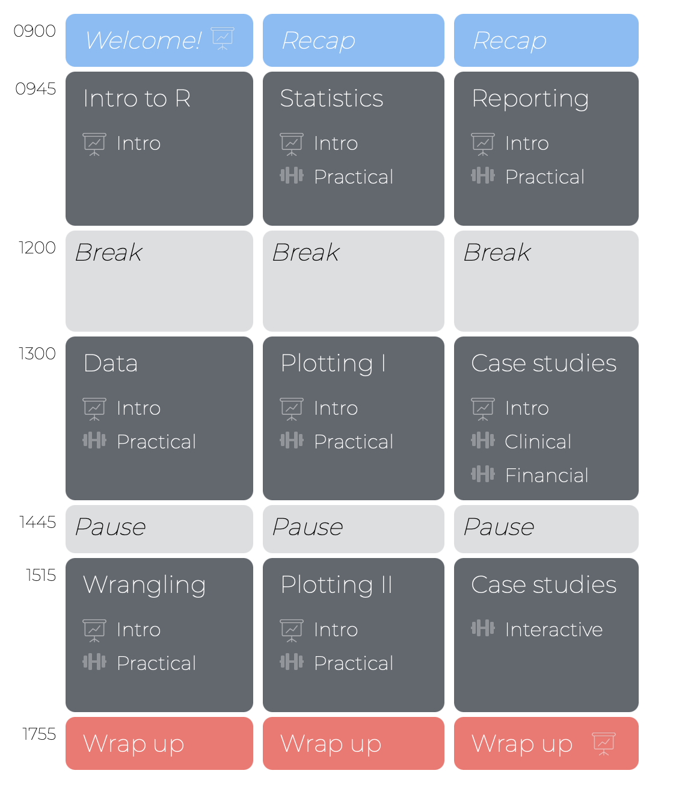

---
.pull-left45[
     
#  Schedule and Materials

Use the "Start Bootcamp" link in Ilias!

]

.pull-right5[

  
<iframe src="https://dwulff.github.io/Intro2R_Unibe_2021/" width="500" height="500"></iframe>

]

---

.pull-left6[

   

# Aim

>###The aim of this workshop is enable you to thoughtfully and actively use R. You will learn the fundamentals of the R language, as well as cutting-edge packages for wrangling, analyzing, and communicating statistical data.  

]

.pull-right4[

    

]

---
  
.pull-left5[
# Schedule 

3 days, <high>3 sessions per day</high>, <high>2 hours per session</high>.

Each session contains a slide-based <high>introduction</high> and a hands-on <high>programming practical</high>

 

]

.pull-right4[

]

---

.pull-left45[

# Introduction

<high>15 - 45 minutes</high> slide based introduction to help you understand the basic concepts, including:

  
&emsp;&emsp;1 - Theory 
&emsp;&emsp;2 - Code examples 
&emsp;&emsp;3 - Live demonstrations  
  

<high>All available online</high>. Follow along, and don't worry about memorizing

  
<a href="https://dwulff.github.io/Intro2R_Unibe_2021/">This is a Link to our materials</a>.
  

]

.pull-right55[

 

 
from <a href="www.Freepik.com">Freepik.com</a>

 
from <a href="www.Freepik.com">Freepik.com</a>

]

---

.pull-left45[

# Practicals

<high>Write your own R scripts!</high>

1 - Anywhere from 10 ~ 30 programming tasks.

2 - Starts easy, gets progressively more challenging

3 - Struggle, work together, ask questions and challenge yourself!

4 - Go at your own pace and finish as much as you can.

5 - We'll give you all the answers later

]

.pull-right5[
 

  <iframe src="https://dwulff.github.io/Intro2R_Unibe_2021/_sessions/Data/Data_practical.html" height="480px" width = "500px"></iframe>

  Example practical:<a href="https://dwulff.github.io/Intro2R_Unibe_2021/_sessions/Data/Data_practical.html"> Data </a>

]

---

.pull-left45[
# Introductions

1. Who are you?

2. What is your study subject?

3. Why do you want to learn R?

4. Mac or PC?

5. Coffee or tea?

6. Berlin or Paris?

]

.pull-right50[

    

 
from <a href="www.artofmanliness.com">artofmanliness.com</a>

]

---

class: middle, center

<h1><a href=https://dwulff.github.io/Intro2R_Unibe_2021/index.html>Schedule</a></h1>

